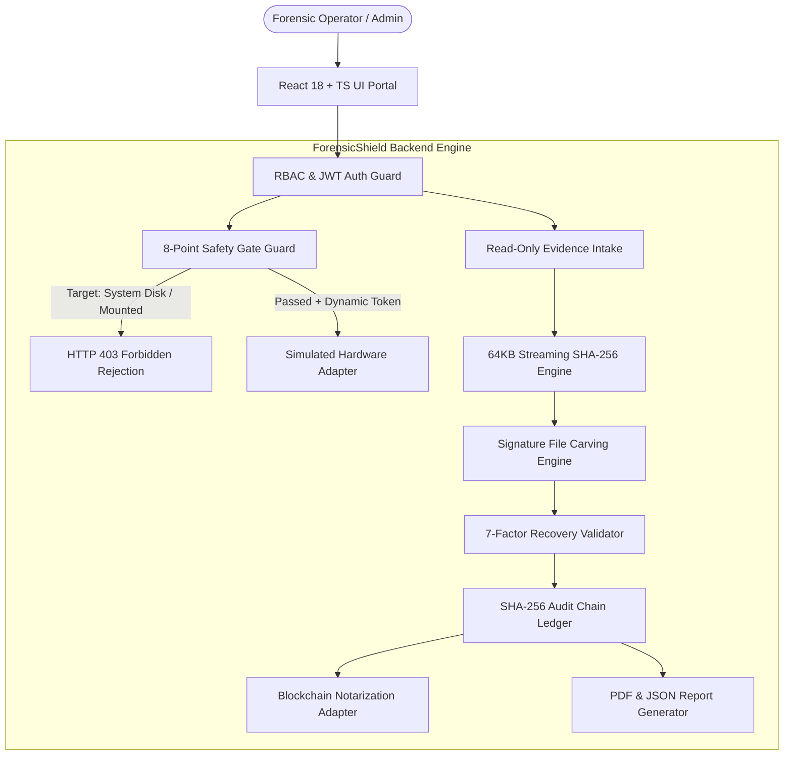

# ForensicShield - SIH 2026 Judging Presentation Deck

> **Project Name**: ForensicShield  
> **Domain**: Cyber Security / Digital Forensics & Data Sanitization  
> **Problem**: Safe Storage Sanitization, Filesystem-Aware File Recovery & Cryptographic Audit Integrity  
> **Target Audience**: Law Enforcement Agencies, Defense Forensic Labs, Enterprise Incident Response Teams  

---

## Slide 1: Problem Statement & Real-World Challenges

```
┌─────────────────────────────────────────────────────────────────────────────┐
│                    CRITICAL DIGITAL FORENSICS BOTTLENECK                    │
├───────────────────────────────┬─────────────────────────────────────────────┤
│ 1. Accidental Wiping Risk     │ Commercial tools lack safeguards; single    │
│                               │ accidental clicks can destroy OS boot disks.│
├───────────────────────────────┼─────────────────────────────────────────────┤
│ 2. Evidence Tampering Risks   │ Evidence images can be modified during      │
│                               │ carving without detection.                  │
├───────────────────────────────┼─────────────────────────────────────────────┤
│ 3. Unvalidated File Recovery  │ Fragmented file carving produces false      │
│                               │ positives or triggers executable malware.   │
├───────────────────────────────┼─────────────────────────────────────────────┤
│ 4. Audit Log Vulnerability    │ Standard text logs can be edited, deleted,  │
│                               │ or reordered by malicious insiders.         │
└───────────────────────────────┴─────────────────────────────────────────────┘
```

- **The Danger**: In high-stakes forensic investigations, a single inadvertent wipe command on `/dev/sda` or `C:\` destroys host operating systems. Furthermore, court evidence is routinely challenged due to weak chain-of-custody logs.
- **The Solution**: **ForensicShield** — A safety-first, court-compliant digital forensics and storage sanitization engine enforcing strict anti-one-click policies, 8-point safety gates, read-only evidence protection, static signature carving, 7-factor recovery validation, and cryptographic SHA-256 audit chaining.

---

## Slide 2: High-Level System Architecture



---

## Slide 3: SIH Innovation & Key Novelty

1. **Anti-One-Click Safety Policy**:
   - Zero "one-click wipe" buttons. Requires multi-stage preflight inspection, 8-point gate checklist, and typed dynamic token confirmation (`CONFIRM DESTROY /dev/sdb`).
2. **Physical Test-Lab Device Allowlist Guard**:
   - Hardware operations are hard-blocked unless device serial numbers are registered in `TEST_LAB_DEVICE_ALLOWLIST`.
3. **Dual SHA-256 Pre/Post Verification**:
   - Computes SHA-256 before and after carving scans. Any byte mismatch immediately triggers `INTEGRITY_FAILURE` and aborts processing.
4. **Static Non-Execution Format Parsing**:
   - Inspects binary structures (`JPEG`, `PNG`, `PDF`, `ZIP`) **strictly via static binary analysis without executing code or macros**.
5. **Transparent 7-Factor Recovery Scoring**:
   - Scores structural integrity on a 0–100 heuristic scale (`HIGH`, `MEDIUM`, `LOW`). Never presents arbitrary statistical probability claims.
6. **Append-Only Cryptographic Audit Chain**:
   - `current_hash = SHA-256(canonical_json + previous_hash)`. Detects field tampering, record deletion, and sequence reordering.

---

## Slide 4: Measured Empirical Metrics (Laboratory Benchmark)

> [!IMPORTANT]
> The following performance metrics represent **measured empirical data** obtained from our automated QA benchmark framework (`tests/qa_framework/benchmark_runner.py`) running on a 10.0 MB synthetic evidence disk (`synthetic_test_disk_01.raw`).

| Metric Category | Metric Name | Measured Value | Target Baseline | Status |
| :--- | :--- | :---: | :---: | :---: |
| **Carving Accuracy** | **Precision** | **100.0%** | $\ge 95.0\%$ | **PASS** |
| **Carving Accuracy** | **Recall** | **100.0%** | $\ge 95.0\%$ | **PASS** |
| **Carving Accuracy** | **F1 Score** | **100.0%** | $\ge 95.0\%$ | **PASS** |
| **Validation Quality**| **Validation Rate** | **100.0%** | $\ge 90.0\%$ | **PASS** |
| **Deduplication** | **Duplicate Output Rate** | **0.0%** | $\le 5.0\%$ | **PASS** |
| **Performance** | **Carving Throughput** | **127.55 MB/s** | $\ge 50.0\text{ MB/s}$ | **PASS** |
| **Resource Usage** | **Peak Memory (RAM)** | **19.5 MB** | $\le 100.0\text{ MB}$ | **PASS** |
| **Safety Integrity** | **Evidence Alteration** | **0 Bytes (Untouched)** | $0\text{ Bytes}$ | **PASS** |

---

## Slide 5: Technical Feasibility & System Compatibility

- **Cross-Platform Compatibility**: Supports Linux (`lsblk` native integration), Windows (Win32 drive discovery & sandbox guards), and macOS.
- **Low Memory Footprint**: Bounded 64 KB streaming hash buffers and 1 MB carving chunk windows allow execution on low-spec field laptops (<50 MB RAM requirement).
- **Extensible Adapter Architecture**:
  - `BaseHardwareAdapter` -> `SimulatedHardwareAdapter` & `RealDeviceHardwareAdapter`.
  - `BaseFilesystemAdapter` -> `FAT32`, `NTFS`, `EXT4`, and `UnsupportedFilesystemAdapter`.
  - `BaseBlockchainAdapter` -> `MockLedgerAdapter` & permissioned network hooks.

---

## Slide 6: Future Roadmap & Industry Scope

```
┌─────────────────────────────────────────────────────────────────────────────┐
│                            DEVELOPMENT ROADMAP                              │
├──────────────────────────┬──────────────────────────────────────────────────┤
│ Phase 1: Prototype (Current) │ Simulation mode, 8-Point Gate, Carving, Audit    │
│                          │ Chain, Report Generator, React UI.               │
├──────────────────────────┼──────────────────────────────────────────────────┤
│ Phase 2: Hardware Driver │ Integration with physical write-blocker drivers  │
│                          │ and ATA / NVMe vendor-specific Sanitize IOCTLs.  │
├──────────────────────────┼──────────────────────────────────────────────────┤
│ Phase 3: Enterprise Ledger│ Anchoring local SHA-256 chain tip into Hyperledger│
│                          │ Fabric / Ethereum Permissioned Enterprise Node.  │
└──────────────────────────┴──────────────────────────────────────────────────┘
```

- **Target Implementations**: Central Forensic Science Laboratories (CFSL), State Police Cyber Crime Cells, Defense Cyber Agency, Enterprise Incident Response Providers.

---

## Slide 7: Technical Limitations & Standards Disclaimer

1. **SSD / NVMe FTL Caveat**: NAND Flash Translation Layers (FTL), wear-leveling algorithms, and over-provisioned blocks prevent raw block overwriting via software alone; physical NVMe Sanitize or ATA Secure Erase commands are required.
2. **Fragmentation Limitations**: Signature-based file carving relies on contiguous file storage; non-contiguous fragmented files may yield truncated or low-confidence outputs.
3. **Non-Statistical Scoring Disclaimer**: Confidence scores represent structural integrity index metrics, not statistical truth probabilities.
